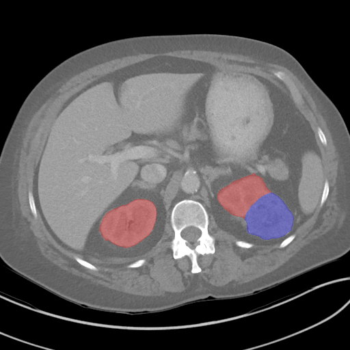

# KiTS19 - Kidney Tumor Segmentation Challenge 2019

This competition is part of the MICCAI 2019 Challenge. 
The goal of this challenge is to accelerate the development of reliable kidney and kidney tumor semantic segmentation methodologies.



## Requirements
* Install [PyTorch](https://pytorch.org/get-started/locally/) (>1.0.0)
* ```pip install -r requirements.txt```

## Getting Started

### 1. Download kits19 Dataset
Make sure to install git-lfs before cloning!
Clone kits19 repository (~20G)

```bash
git clone https://github.com/neheller/kits19.git
```

### 2. Conversion data
Conversion nii.gz to npy for easy to read slice

```bash
python conversion_data.py -d "kits19/data" -o "data"
```

### 3. Train ResUNet for Coarse Kidney Segmentation
```bash
python train_res_unet.py -e 100 -b 32 -l 0.0001 -g 4 -s 512 512 --data "data" --log "runs/ResUNet" --eval_intvl 5 --cp_intvl 5 --vis_intvl 0 --num_workers 8
```

### 4. Capture Coarse Kidney ROI
```bash
python get_roi.py -b 32 -g 4 -s 512 512 -d "data" -r "runs/ResUNet/checkpoint/best.pth" -o "data/roi.json"
```

### 5. Train DenseUNet for Kidney Tumor Segmentation
```bash
python train_dense_unet.py -e 100 -b 32 -l 0.0001 -g 4 -s 512 512 --data "data" --log "runs/DenseUNet" --vis_intvl 0 --num_workers 8
```

### 6. Evaluation Test Case
```bash
python eval_dense_unet.py -b 32 -g 4 -s 512 512 --data "data" -r "runs/DenseUNet/checkpoint/best.pth" --vis_intvl 0 --num_workers 8 -o "out"
```

### 7. Post-processing
```bash
python post_processing.py -d "out" -o "out_proc"
```

## Leaderboard


We are the 21st of total 106 teams.

## TODO
- [x] Refactor code
- [ ] Describe method
- [ ] Show result
- [ ] Write argument help
